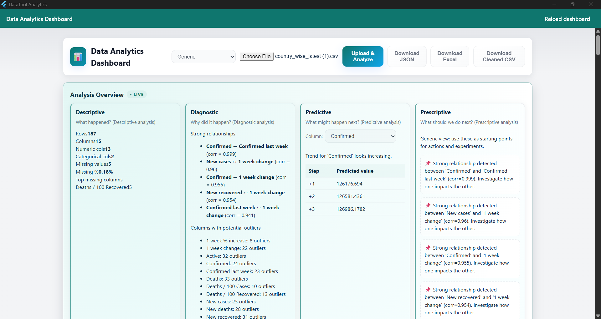

# Data Analytics Desktop

A powerful Flutter desktop application for comprehensive data analysis and visualization. This tool allows users to upload CSV files, perform statistical analysis, and generate interactive visualizations including histograms and boxplots.

## Features

- **File Upload & Processing**: Easy CSV file upload with automatic data parsing
- **Statistical Analysis**: Calculate percentage changes and trends over time periods
- **Interactive Visualizations**: 
  - Histograms for data distribution analysis
  - Boxplots for statistical summary and outlier detection
- **Multiple Export Options**: Download processed data as JSON, Excel, or Cleaned CSV
- **Real-time Dashboard**: Live updates with reload functionality
- **User-friendly Interface**: Clean and intuitive design for data exploration

## Screenshots

### Main Dashboard


The main interface shows file upload options, key metrics (like confirmed cases), and visualization panels.

### Data Visualizations


Interactive histograms and boxplots displaying 1-week percentage increases and changes in the data.

## Getting Started

### Prerequisites
- Flutter SDK (stable version)
- Windows, macOS, or Linux desktop environment

### Installation

1. Clone this repository:
```bash
git clone https://github.com/balamathan0509/datatool_desktop.git
cd datatool_desktop
```

2. Install dependencies:
```bash
flutter pub get
```

3. Run the application:
```bash
flutter run -d windows
```

### Usage

1. Launch the application
2. Click "Choose File" to select your CSV data file
3. Click "Upload & Analyze" to process the data
4. View the generated visualizations and statistics
5. Export results using the download buttons (JSON, Excel, or Cleaned CSV)

## Web Version

You can also try the web version of this application:
https://balamathan0509.github.io/datatool_desktop/

## Technologies Used

- **Flutter**: Cross-platform UI framework
- **Dart**: Programming language
- **Data Visualization**: Custom chart implementations
- **File Processing**: CSV parsing and data analysis

## Contributing

Contributions are welcome! Please feel free to submit a Pull Request.

## License

This project is licensed under the MIT License.
